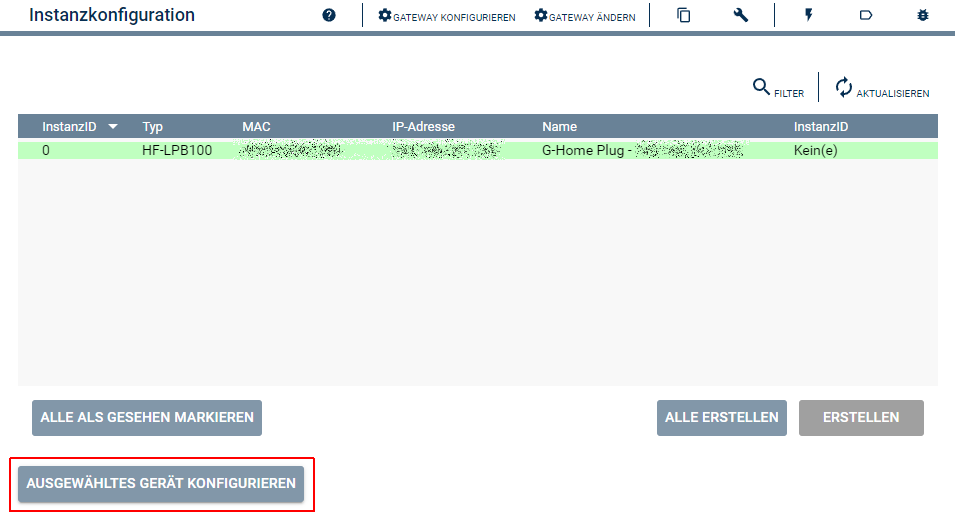

  

# G-Homa Konfigurator  
Vereinfacht das Anlegen von 'G-Home Plug'-Instanzen.  
Und kann zum konfigurieren von den Geräten genutzt werden.  

## Dokumentation

**Inhaltsverzeichnis**

1. [Funktionsumfang](#1-funktionsumfang)  
2. [Voraussetzungen](#2-voraussetzungen)  
3. [Software-Installation](#3-software-installation) 
4. [Einrichten der Instanzen in IP-Symcon](#4-einrichten-der-instanzen-in-ip-symcon)
5. [Statusvariablen und Profile](#5-statusvariablen-und-profile)
6. [WebFront](#6-webfront)
7. [PHP-Befehlsreferenz](#7-php-befehlsreferenz) 
8. [Anhang](#8-anhang)  
9. [Lizenz](#9-lizenz)

## 1. Funktionsumfang

 - Auslesen und darstellen aller im Netzwerk gefundenen G-Home WLAN-Steckdosen.  
 - Einfaches Anlegen von neuen Instanzen in IPS.  
 - Auslesen und anpassen der Konfiguration in den Geräten.  

## 2. Voraussetzungen

 - IPS 4.3 oder höher  
 - G-Homa WLAN-Steckdosen  

## 3. Software-Installation

 Dieses Modul ist Bestandteil der GHoma-Library.

**IPS 4.3:**  
   Bei privater Nutzung: Über das 'Module-Control' in IPS folgende URL hinzufügen.  
    `git://github.com/Nall-chan/GHoma.git`  

   **Bei kommerzieller Nutzung (z.B. als Errichter oder Integrator) wenden Sie sich bitte an den Autor.**  

## 4. Einrichten der Instanzen in IP-Symcon

Das Modul ist im Dialog 'Instanz hinzufügen' unter dem Hersteller 'G-Homa' zufinden.  
  

Alternativ ist es auch in der Liste alle Konfiguratoren aufgeführt.  
  

Es wird automatisch eine 'Multicast-Socket' Instanz erzeugt.  
Werden in dem sich öffnenden Konfigurationsformular keine Geräte angezeigt, so kann das erneute durchsuchen des Netzwerkes mit dem Button 'Netzwerk durchsuchen' gestartet werden.  

Beim öffnen des Konfigurator wird folgendender Dialog angezeigt.  
  

Über das selektieren eines Eintrages in der Tabelle und anschließenden betätigen einer der Buttons,  
können verschiedene Einstellungen im Gerät geändert werden.  
Oder eine Instanz in IPS erzeugt werden.  

Bevor ein Gerät in IPS benutzt werden kann, muss es einmalig für Symcon umkonfiguriert werden.  
Dies wird automatisch beim speichern der WLAN-Daten oder über den Button 'Umkonfigurieren für IPS' durchgeführt.  

## 5. Statusvariablen und Profile

Der Konfigurator besitzt keine Statusvariablen und Variablenprofile.  

## 6. WebFront

Der Konfigurator besitzt keine im WebFront darstellbaren Elemente.  

## 7. PHP-Befehlsreferenz

Der Konfigurator besitzt keine dokumentierten Instanz-Funktionen.  

## 8. Anhang

**Changlog:**  

Version 1.0:  
 - Erstes offizielles Release  

## 9. Lizenz

  IPS-Modul:  
  [CC BY-NC-SA 4.0](https://creativecommons.org/licenses/by-nc-sa/4.0/)  
