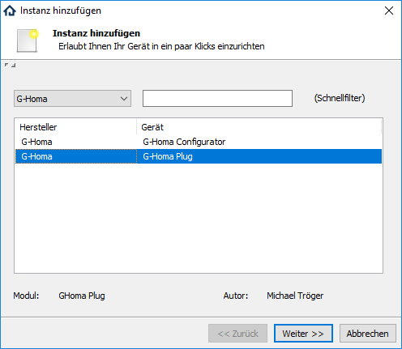
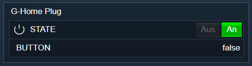

[](https://www.symcon.de/service/dokumentation/entwicklerbereich/sdk-tools/sdk-php/)
[]()
  
[](https://creativecommons.org/licenses/by-nc-sa/4.0/)
[](https://github.com/Nall-chan/GHoma/actions) [](https://github.com/Nall-chan/GHoma/actions)  
[](../README.md/#6-spenden)  

# G-Homa Plug  <!-- omit in toc -->
Einbindung einer WLAN-Steckdose von der Firma 'G-Homa'.  

## Inhaltsverzeichnis  <!-- omit in toc -->

- [1. Funktionsumfang](#1-funktionsumfang)
- [2. Voraussetzungen](#2-voraussetzungen)
- [3. Software-Installation](#3-software-installation)
- [4. Einrichten der Instanzen in IP-Symcon](#4-einrichten-der-instanzen-in-ip-symcon)
- [5. Statusvariablen und Profile](#5-statusvariablen-und-profile)
- [6. WebFront](#6-webfront)
- [7. PHP-Befehlsreferenz](#7-php-befehlsreferenz)
- [8. Anhang](#8-anhang)
  - [1. Changelog](#1-changelog)
  - [2. Spenden](#2-spenden)
- [9. Lizenz](#9-lizenz)

## 1. Funktionsumfang

 - Empfangen und darstellen des aktuellen Schaltzustandes, sowie der Energiemessung.  
 - Steuern des Gerätes aus IPS über WebFront und PHP-Scripten.  

## 2. Voraussetzungen

 - IPS 7.0 oder höher  
 - G-Homa WLAN-Steckdosen  

## 3. Software-Installation

 Dieses Modul ist Bestandteil der GHoma-Library.

  
  Über den 'Module-Store' in IPS das Modul 'G-Homa' hinzufügen.  
   **Bei kommerzieller Nutzung (z.B. als Errichter oder Integrator) wenden Sie sich bitte an den Autor.**  
 

**Hinweis:**
  Eine eventuell vorhandene Firewall auf dem Host-System des IPS-Servers, muss so konfiguriert werden dass der Port 4196 TCP ankommend freigegeben ist.  

## 4. Einrichten der Instanzen in IP-Symcon

Das Anlegen von neuen Instanzen kann komfortabel über den [G-Homa Discovery:](../GHDiscovery/) erfolgen.  

Alternativ ist das Modul im Dialog 'Instanz hinzufügen' unter dem Hersteller 'G-Homa' zu finden.  
  

Es wird automatisch eine 'Server-Socket' Instanz erzeugt, wenn nicht schon eine passende vorhanden ist.  
In dem sich öffnenden Konfigurationsformular muss die IP-Adresse des Gerätes eingetragen und übernommen werden.  

**Konfigurationsseite:**  

| Eigenschaft |  Typ   | Standardwert |          Funktion          |
| :---------: | :----: | :----------: | :------------------------: |
|    Host     | string |              | Die IP-Adresse des Gerätes |


## 5. Statusvariablen und Profile

Folgende Statusvariablen werden automatisch angelegt.  

|      Name       |  Typ  |    Ident    |                                     Beschreibung                                      |
| :-------------: | :---: | :---------: | :-----------------------------------------------------------------------------------: |
|      STATE      | bool  |    STATE    |                         True wenn das Gerät eingeschaltet ist                         |
|     BUTTON      | bool  |   BUTTON    |    Wird auf True aktualisiert, wenn das Gerät über die Gerätetaste betätigt wurde.    |
|      ALARM      | bool  |    ALARM    | Wird auf True aktualisiert, wenn die Gerätetaste länger als 5 Sekunden gedrückt wird. |
|    Leistung     | float |    Power    |                                   Leistung in Watt                                    |
|    Verbrauch    | float | Consumption |                                   Verbrauch in kWh                                    |
|    Spannung     | float |   Voltage   |                                   Spannung in Volt                                    |
|      Strom      | float |   Current   |                                    Strom in Ampere                                    |
|    Frequenz     | float |  Frequenz   |                                       Frequenz                                        |
| Scheinleistung  | float |   Output    |                                 Scheinleistung in VA                                  |
| Leistungsfaktor | float | PowerFactor |                                    Leistungsfaktor                                    |

**Profile**:

|   Name   |  Typ  | verwendet von Statusvariablen |
| :------: | :---: | :---------------------------: |
| GHoma.VA | float |        Scheinleistung         |

## 6. WebFront

Die direkte Darstellung und Steuerung im WebFront ist möglich.  
  


## 7. PHP-Befehlsreferenz

```php
bool GHOMA_SendSwitch(int $InstanzID, bool $Value)
```
Schaltet das Gerät bei `true` ein oder bei `false` aus.  
Hat das Gerät den Befehl erfolgreich ausgeführt, wird `true` zurück gegeben.  
Im Fehlerfall wird eine Warnung erzeugt und `false`zurück gegeben.  


## 8. Anhang

### 1. Changelog

[Changelog der Library](../README.md#3-changelog)

### 2. Spenden

Die Library ist für die nicht kommerzielle Nutzung kostenlos, Schenkungen als Unterstützung für den Autor werden hier akzeptiert:  

<a href="https://www.paypal.com/donate?hosted_button_id=G2SLW2MEMQZH2" target="_blank"></a>

[](https://www.amazon.de/hz/wishlist/ls/YU4AI9AQT9F?ref_=wl_share)

## 9. Lizenz

  IPS-Modul:  
  [CC BY-NC-SA 4.0](https://creativecommons.org/licenses/by-nc-sa/4.0/)  
