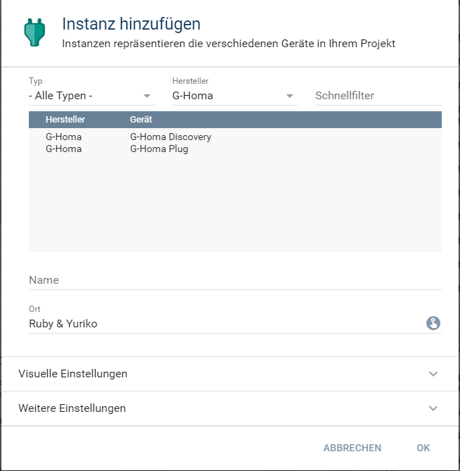

[](https://www.symcon.de/service/dokumentation/entwicklerbereich/sdk-tools/sdk-php/)
[]()
[](https://creativecommons.org/licenses/by-nc-sa/4.0/)  
[](https://www.symcon.de/forum/threads/30857-IP-Symcon-4-3-%28Stable%29-Changelog)

# G-Homa Plug  
Einbindung einer WLAN-Steckdose von der Firma 'G-Homa'.  

## Dokumentation

**Inhaltsverzeichnis**

1. [Funktionsumfang](#1-funktionsumfang)  
2. [Voraussetzungen](#2-voraussetzungen)  
3. [Software-Installation](#3-software-installation) 
4. [Einrichten der Instanzen in IP-Symcon](#4-einrichten-der-instanzen-in-ip-symcon)
5. [Statusvariablen und Profile](#5-statusvariablen-und-profile)
6. [WebFront](#6-webfront)
7. [PHP-Befehlsreferenz](#7-php-befehlsreferenz) 
8. [Anhang](#8-anhang)  
9. [Lizenz](#9-lizenz)

## 1. Funktionsumfang

 - Empfangen und darstellen des aktuellen Schaltzustandes.  
 - Steuern des Gerätes aus IPS über WebFront und PHP-Scripten.  

## 2. Voraussetzungen

 - IPS 4.3 oder höher  
 - G-Homa WLAN-Steckdosen  

## 3. Software-Installation

 Dieses Modul ist Bestandteil der GHoma-Library.

**IPS 4.3:**  
   Bei privater Nutzung: Über das 'Module-Control' in IPS folgende URL hinzufügen.  
    `git://github.com/Nall-chan/GHoma.git`  

   **Bei kommerzieller Nutzung (z.B. als Errichter oder Integrator) wenden Sie sich bitte an den Autor.**  

## 4. Einrichten der Instanzen in IP-Symcon

Das Anlegen von neuen Instanzen kann komfortabel über den [G-Homa Konfigurator:](../GHConfigurator/) erfolgen.  

Alternativ ist das Modul im Dialog 'Instanz hinzufügen' unter dem Hersteller 'G-Homa' zufinden.  
  

Es wird automatisch eine 'Client-Socket' Instanz erzeugt.  
Werden in dem sich öffnenden Konfigurationsformular werden keine Einstellungen vorgenommen.  
Über den Button 'Gateway konfigurieren' oder das Zahnrad hinter der Übergeordneten Instanz wird das Konfigurationsformular des 'Client-Socket' geöffnet.  
Hier muss jetzt die IP-Adresse des Gerätes eingetragen und übernommen werden.  

## 5. Statusvariablen und Profile

Folgende Statusvariablen werden automatisch angelegt.  

| Name   | Typ     | Ident  | Beschreibung                                                                    |
| :----: | :-----: | :----: | :-----------------------------------------------------------------------------: |
| STATE  | boolean | STATE  | True wenn das Gerät eingeschaltet ist                                           |
| BUTTON | boolean | BUTTON | Wird auf True aktualisiert, wenn das Gerät über die Gerätetaste betätigt wurde. |

Es werden keine neuen Profile angelegt.

## 6. WebFront

Die direkte Darstellung und Steuerung im WebFront ist möglich.  
  


## 7. PHP-Befehlsreferenz

```php
bool GHOMA_SendSwitch(int $InstanzID, bool $Value)
```
Schaltet das Gerät bei `true` ein oder bei `false` aus.  
Hat das Gerät den Befehl erfolgreich ausgeführt, wird `true` zurück gegeben.  
Im Fehlerfall wird eine Warnung erzeugt und `false`zurück gegeben.  


## 8. Anhang

**Changlog:**  

Version 1.0:  
 - Erstes offizielles Release  

## 9. Lizenz

  IPS-Modul:  
  [CC BY-NC-SA 4.0](https://creativecommons.org/licenses/by-nc-sa/4.0/)  
