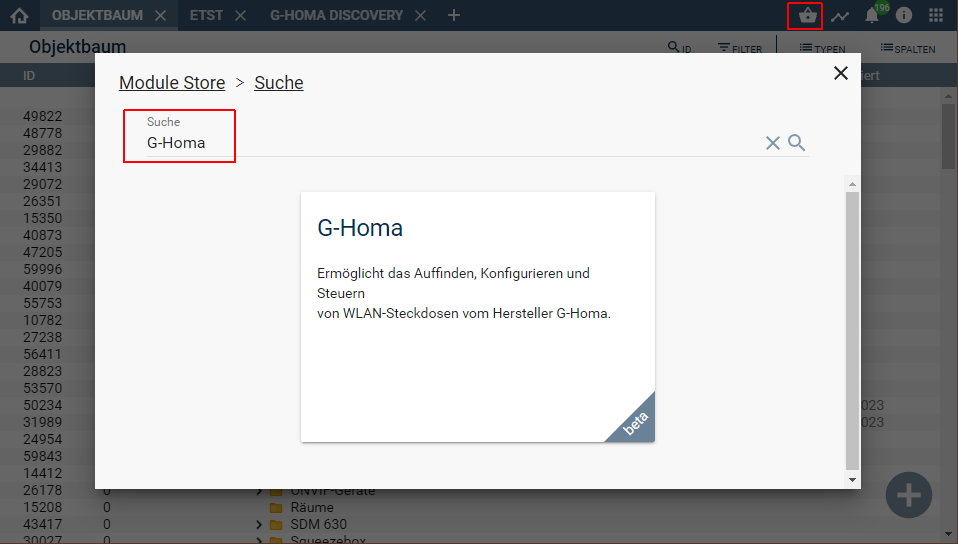

  

   
  

# GHoma  <!-- omit in toc -->
Ermöglicht das Auffinden, Konfigurieren und Steuern
von WLAN-Steckdosen vom Hersteller G-Homa.

## Inhaltsverzeichnis  <!-- omit in toc -->

- [1. Funktionsumfang](#1-funktionsumfang)
  - [G-Homa Plug:](#g-homa-plug)
  - [G-Homa Discovery:](#g-homa-discovery)
- [2. Voraussetzungen](#2-voraussetzungen)
- [3. Software-Installation](#3-software-installation)
- [4. Einrichten der Instanzen in IP-Symcon](#4-einrichten-der-instanzen-in-ip-symcon)
- [5. Anhang](#5-anhang)
  - [1. GUID der Module](#1-guid-der-module)
  - [2. Hinweise](#2-hinweise)
  - [3. Changelog](#3-Changelog)
- [6. Spenden](#6-spenden)
- [7. Lizenz](#7-lizenz)

## 1. Funktionsumfang

### [G-Homa Plug:](GHPlug/)  

 - Steuern des Schaltzustands.  
 - Empfangen und Darstellen des Schaltzustands, sowie der Energiemessung.  

### [G-Homa Discovery:](GHDiscovery/)  

 - Auflisten alle im Netzwerk verfügbaren Geräte.  
 - Erstellen von neuen 'G-Homa Plug'-Instanzen in IPS.  
 - Abfragen der Konfiguration der Geräte.  
 - Konfigurieren der Geräte für den Betrieb mit IPS.  
 - Konfigurieren von Parametern für Netzwerk und Zeitserver der Geräte.  

## 2. Voraussetzungen

 - IPS 6.3 oder höher  
 - G-Homa WLAN-Steckdosen  

## 3. Software-Installation

  Über den 'Module-Store' in IPS das Modul 'G-Homa' hinzufügen.  
   **Bei kommerzieller Nutzung (z.B. als Errichter oder Integrator) wenden Sie sich bitte an den Autor.**  
  

## 4. Einrichten der Instanzen in IP-Symcon

Details sind in der Dokumentation der jeweiligen Module beschrieben.  
Es wird dingend empfohlen die Einrichtung mit dem G-Homa Discovery zu starten.  

Die Geräte müssen eine spezielle Konfiguration erhalten, welche über den 'Discovery'  
an die Geräte übertragen werden muss.  

Damit IPS die Geräte findet, müssen diese im WLAN erreichbar sein.  
Außerdem müssen Symcon und die Geräte im gleichen IP-Segment sein, da die Discovery-Instanz über einen UDP Broadcast läuft.  

Um die Geräte mit dem eigenen WLAN zu koppeln, kann die Hersteller APP genutzt werden.  

Alternativ ist es auch über folgenden Weg auch IPS möglich:  

- IPS muss auf einem Gerät installiert sein, welches über eine WLAN-Schnittstelle verfügt.  
- Die Geräte müssen auf Werkseinstellung gesetzt sein (schnelles Blinken der LED).  
- Das neue Gerät mit einem ca. 3 Sekunden Tastendruck in den AP-Modus versetzen.  
- Der Host von der IPS installation muss mit dem AP 'G-Homa' verbunden werden (DHCP muss aktiv sein!).  
- Anschließend ist die Instanz 'G-Homa Discovery' zu öffnen. Wird kein Gerät angezeigt, so ist der Button 'Netzwerk durchsuchen' zu betätigen.  
- Wird noch immer kein Gerät gefunden, so die übergeordnete Instanz 'Multicast-Socket' öffnen und einmal neu aktivieren.  
- Anschließend ist die Instanz 'G-Homa Discovery' zu öffnen. Wird kein Gerät angezeigt, so ist der Button 'aktualisieren' zu betätigen.  
- Das neu gefundene Gerät ist in der Liste des 'G-Homa Discovery' auszuwählen.  
- Anschließend müssen die WLAN-Daten im unteren Teil der Konfiguration eingetragen werden und abschließen mit dem Button 'Schreibe WLAN' an das Gerät übertragen werden.  
- Das Gerät startet neu und kann ab sofort mit IPS verwendet werden.  
- Anschließend muss über den Button `Ausgewähltes Gerät konfigurieren` die WLAN Konfiguration eingetragen werden und abschließen mit dem Button 'Schreibe WLAN' an das Gerät übertragen werden.  
- Weitere Konfiguration siehe im [G-Homa Discovery:](GHDiscovery/)  

## 5. Anhang

###  1. GUID der Module

 
|      Modul      |    Typ    | Prefix |                  GUID                  |
| :-------------: | :-------: | :----: | :------------------------------------: |
|   GHoma Plug    |  Device   | GHOMA  | {5F0CF4B0-7395-4ABF-B10F-AA0109A0F016} |
| GHoma Discovery | Discovery | GHOMA  | {535EF8FE-EE78-4385-8B61-D118FAE5AE5A} |

### 2. Hinweise  

 Die Konfiguration der Geräte kann jederzeit über ein verbundenes WLAN/LAN oder den integrierten Access-Point  
 ausgelesen und verändert werden.  
 Der Zugriff ist nicht abgesichert und somit können auch gespeicherte WLAN-Zugangsdaten  
 ausgelesen werden.  
 Die Geräte sollten somit nicht im öffentlich zugänglichen Bereich betrieben werden,  
 da über einen langen Tastendruck der AP-Modus (unverschlüsselt!) aktiviert wird und  
 alle Daten ausgelesen werden können.  
 
 Dieses Modul trennt die Verbindung von den Geräten zur (chinesischen) Cloud.  
 IPS fungiert für die Geräte als Master und eine verlorene Verbindung zu IPS wird  
 mit einer blinkenden LED an den Geräten signalisiert.  

### 3. Changelog

Version 6.0:  
 - Konfigurator in Discovery Instanz geändert.  
 - Discovery benötigt keinen IO mehr.  
 - Konfigurieren der Geräte über das Konfigurationsformular der Discovery-Instanz komplett überarbeitet.  
 - Verwaltung des verbundenen Gerätes in der Geräte-Instanz überarbeitet.  

Version 5.0:  
 - Intern Überarbeitet.  

Version 2.0:  
 - Geräte werden über den Server Socket angebunden anstatt wie bisher über einen Client Socket (Nur für IPS 5.0)  

Version 1.1:  
 - Fixes für IPS 5.0  

Version 1.0:  
 - Erstes offizielles Release  

## 6. Spenden  
  
  Die Library ist für die nicht kommerzielle Nutzung kostenlos, Schenkungen als Unterstützung für den Autor werden hier akzeptiert:  

## 7. Lizenz

  [CC BY-NC-SA 4.0](https://creativecommons.org/licenses/by-nc-sa/4.0/)  
